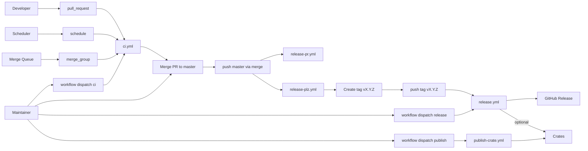
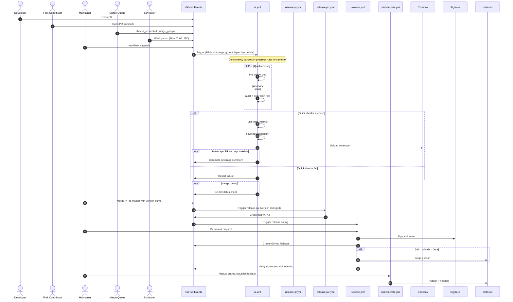
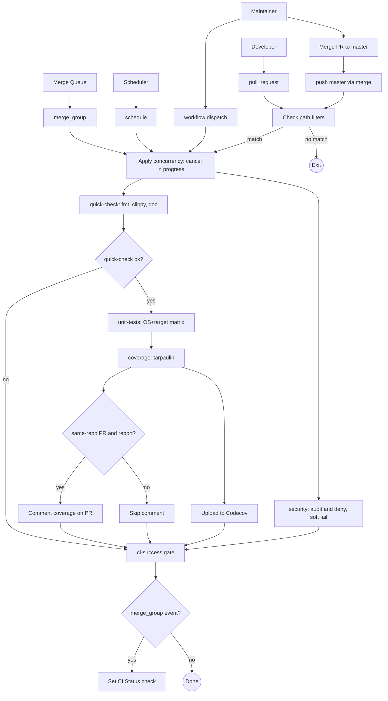
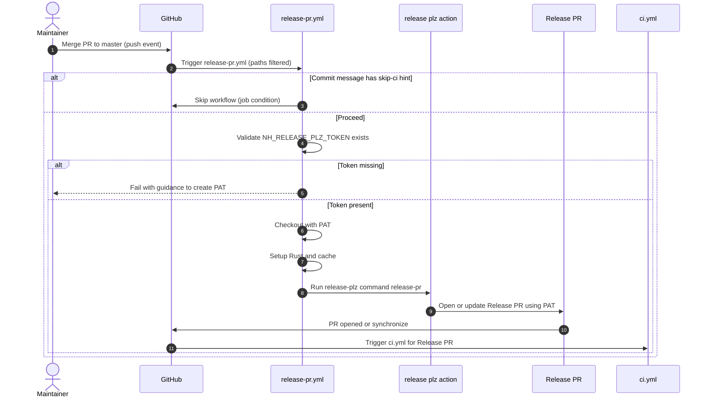
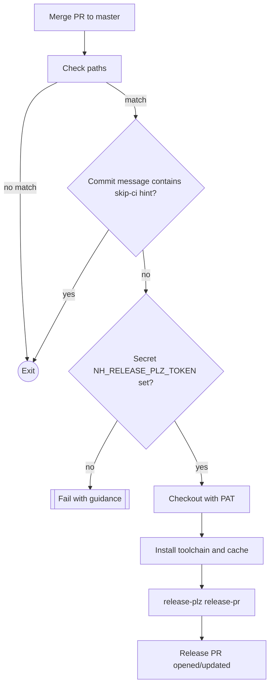
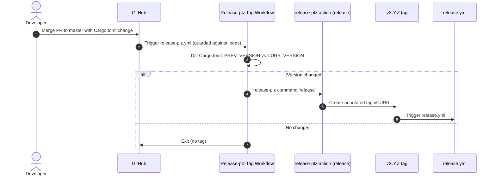
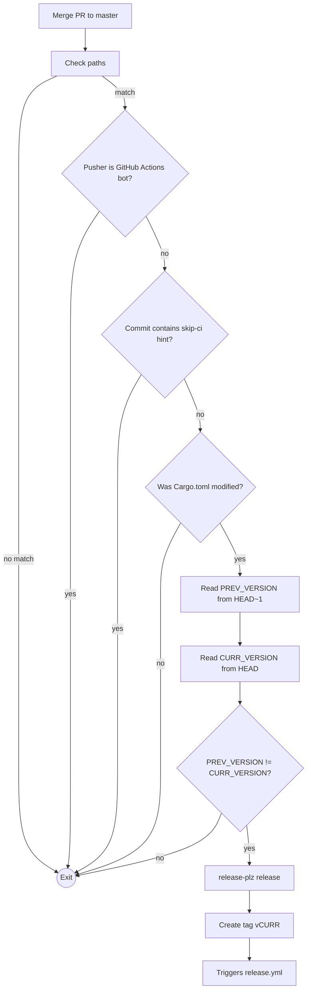
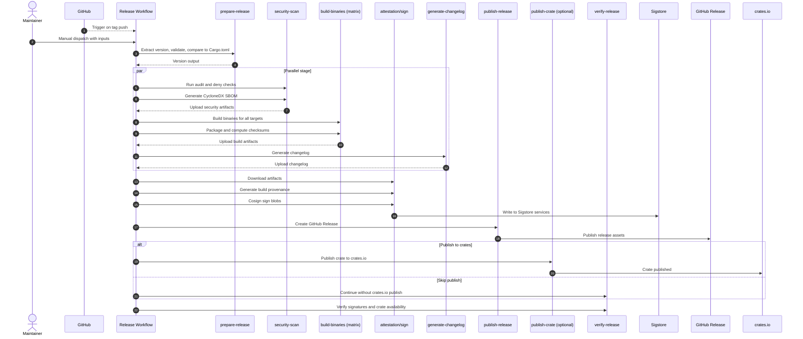
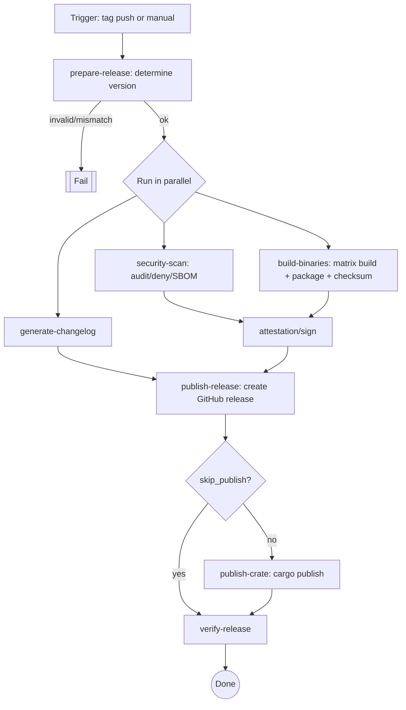
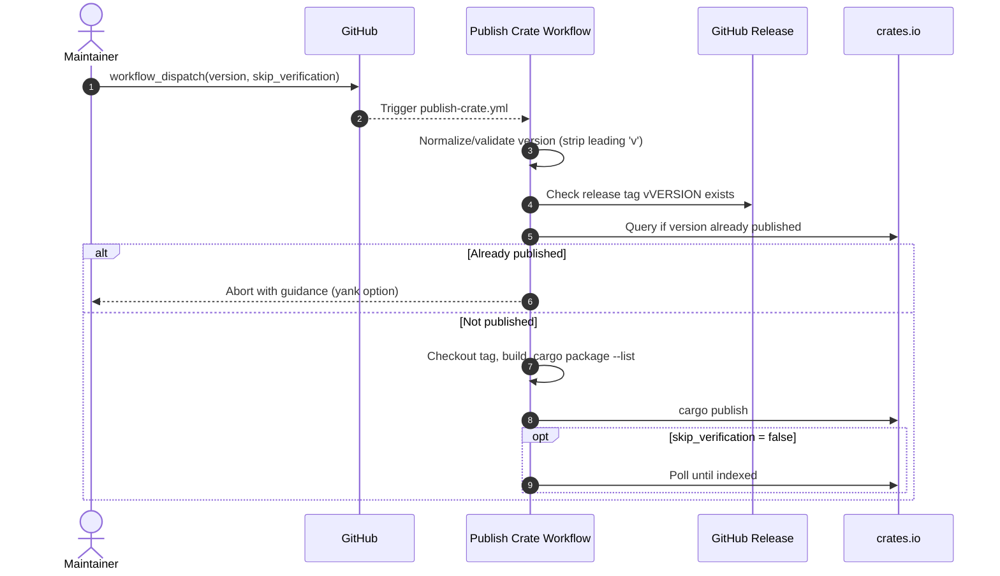

# How These Workflows Operate (Triggers, Actors, Dependencies)

This section explains, with detailed sequence and flow diagrams, how each GitHub Actions workflow is triggered, who/what can trigger it, and how they depend on one another.

Key actors
- Developer: pushes commits, opens PRs, merges PRs.
- Fork Contributor: opens PRs from a fork.
- Maintainer: manually dispatches workflows, manages releases.
- Merge Queue: GitHub merge queue invoking `merge_group` events.
- Scheduler: Weekly cron triggering CI on Mondays 00:00 UTC.
- Release-plz Action: automation that opens release PRs or tags versions.
- External services: Codecov, Sigstore (Fulcio/Rekor), crates.io.

Event-to-workflow mapping (with path filters)
- ci.yml
  - pull_request: opened/synchronize/reopened when files under `src/**`, `Cargo.{toml,lock}`, `.github/workflows/**`, `.tarpaulin.toml` change.
  - push: branch `master` with same path filters.
  - merge_group: `checks_requested`.
  - workflow_dispatch: manual run by a maintainer.
  - schedule: weekly cron.
- release-pr.yml
  - push: branch `master` with same Rust-related path filters; skips when commit message contains `[skip ci]`.
- release-plz.yml
  - push: branch `master` with same filters; guarded to avoid loops (not `github-actions[bot]`, no `[skip ci]`); runs only if `Cargo.toml` version changed vs previous commit.
- release.yml
  - push: tags matching `v*.*.*`.
  - workflow_dispatch: manual, with inputs `version` and `skip_publish`.
- publish-crate.yml
  - workflow_dispatch: manual, with inputs `version` and `skip_verification`.

Note on concurrency
- ci.yml uses a concurrency group keyed by workflow name and PR number or ref; new runs cancel in-progress ones for the same PR/branch.

Overall interdependency (high level)



## Global Interactions (Sequence)



## ci.yml (Detailed Flowchart)



## release-pr.yml (Release PR automation)





## release-plz.yml (Tagging on version bump)





## release.yml (Full release pipeline)





## publish-crate.yml (Manual crates.io fallback)



---

# CI/CD Workflows Analysis (as of 2025-10-05)

This report reviews all workflows in `.github/workflows` and maps their dependencies, highlights issues, and proposes concrete improvements and potential rewrites. File/line references use the repository’s current state.

## Workflow Inventory

- `ci.yml`: Continuous Integration for PRs, pushes to `master`, merge queue, weekly schedule. Stages: quick checks → unit tests (matrix) → coverage; security audit runs in parallel; a final “CI Success” gate consolidates results.
- `release-pr.yml`: Creates/updates a release PR on pushes to `master` using `release-plz` and a PAT (`NH_RELEASE_PLZ_TOKEN`).
- `release-plz.yml`: On version bump in `Cargo.toml` on `master`, runs `release-plz` in “release” mode to tag a version (which triggers the release pipeline).
- `release.yml`: Full release pipeline triggered by `v*.*.*` tags or manual dispatch. Stages: prepare version → security scan/SBOM → build (matrix) → attestation/signing → changelog → GitHub Release → crates.io publish → verification.
- `publish-crate.yml`: Manual fallback to publish an existing tagged release to crates.io.

## Dependency Map

High-level flow (→ indicates “triggers/depends on”):

```
Push/PR → ci.yml (quick-check → unit-tests → coverage) & security (parallel) → ci-success

master push with version bump → release-plz.yml (release) → tag vX.Y.Z → release.yml

release.yml: prepare-release → [security-scan, build-binaries → attestation, generate-changelog]
            → publish-release → [publish-crate (optional), verify-release]

publish-crate.yml is manual only; independent of release.yml except for tags existing.
release-pr.yml is orthogonal; manages release PRs on master.
```

Explicit job dependencies inside `ci.yml` and `release.yml` are sound and avoid flakiness from implicit ordering.

## Major Findings

1) Incorrect cosign OIDC issuer (breaks keyless signing)
- Location: `.github/workflows/release.yml:321-326`.
- Issue: `cosign sign-blob` is invoked with `--oidc-issuer="${FULCIO_URL}"`. `FULCIO_URL` is the CA, not the OIDC issuer. The correct issuer for GitHub Actions is `https://token.actions.githubusercontent.com`.
- Impact: Signing can fail or produce unverifiable signatures.
- Fix:
  - Prefer defaults (cosign auto-detects on Actions) or set explicitly: `--oidc-issuer "https://token.actions.githubusercontent.com"`.
  - If you want to pin endpoints via env, use the variables cosign recognizes (e.g., `COSIGN_OIDC_ISSUER`, `COSIGN_FULCIO_URL`, `COSIGN_REKOR_URL`), not `FULCIO_URL`/`REKOR_URL` alone.

2) Signature verification ties identity to master branch, but releases are tagged
- Location: `.github/workflows/release.yml:534-540`.
- Issue: Verification uses `--certificate-identity-regexp` with `.../release.yml@refs/heads/master`. Release runs are triggered by tags (`refs/tags/v*`).
- Impact: Verification will fail even if signatures are correct.
- Fix options:
  - Match tags: `.../.github/workflows/release.yml@refs/tags/v.*`.
  - Or use a more robust regex anchored to workflow path only (and optionally repo owner): `.../.github/workflows/release.yml@.*` combined with `--certificate-oidc-issuer https://token.actions.githubusercontent.com`.

3) Coverage artifact filename mismatch risk
- Location: `ci.yml` Codecov upload and comment steps expect `target/tarpaulin/cobertura.xml` (`ci.yml:234-261, 243-249, 261`).
- In `.tarpaulin.toml` the XML output is enabled, but tarpaulin often writes `tarpaulin-report.xml` by default for XML. If the filename is `tarpaulin-report.xml`, the Codecov upload and PR comment steps won’t find it (guarded by `hashFiles` and `fail_ci_if_error: false`).
- Fix options:
  - Standardize the filename: change CI to `files: target/tarpaulin/tarpaulin-report.xml` and read the same in the comment step; or
  - Configure tarpaulin to emit `cobertura.xml` explicitly (if supported) and keep CI as-is; or
  - Switch to `cargo-llvm-cov` which produces consistent artifacts across platforms.

4) Global `RUSTFLAGS=-D warnings` can cause spurious failures
- Location: `ci.yml:44-49`.
- Issue: Setting `-D warnings` globally affects dependencies during `cargo test` builds, not just your crate(s).
- Impact: Third-party warnings can fail CI unexpectedly.
- Fix: Remove the global `RUSTFLAGS` and rely on `cargo clippy -- -D warnings` (`ci.yml:84-85`) and `RUSTDOCFLAGS` just for docs (`ci.yml:87-90`). If you want to gate compile-time warnings for the workspace only, use `RUSTFLAGS` with `--config warnings=...` per package or `workspace.lints` in `Cargo.toml`.

5) Cosign/Sigstore env naming
- Location: `release.yml:34-44` and `attestation` job.
- Issue: Using `FULCIO_URL`/`REKOR_URL` env keys is non-standard; cosign recognizes `COSIGN_FULCIO_URL`/`COSIGN_REKOR_URL`.
- Impact: URLs may be ignored if cosign arguments don’t override them.
- Fix: Rename envs to `COSIGN_FULCIO_URL` and `COSIGN_REKOR_URL`, or pass flags explicitly.

## Minor Findings

- Permissions scope in CI is broader than necessary
  - `ci.yml:51-55` grants `pull-requests: write` and `checks: write` globally. Only the coverage comment and merge-queue check creation actually need elevated perms. Narrow permissions at the job level where needed.

- Test parallelism is disabled
  - `ci.yml:189-190` forces `--test-threads=1`. Unless tests are flaky or depend on global state, allow default parallelism for speed and use per-test synchronization where needed.

- musl test target without dependency checks
  - `ci.yml:183-188` installs `musl-tools`, but many crates need additional system libs or `pkg-config`. Consider gating musl in a separate job or using `cross` for musl tests too for consistency.

- Release matrix breadth
  - `release.yml:154-190` builds a wide target set including `riscv64` and Windows ARM64. If these are experimental, mark them optional (non-blocking) or build them behind a flag to reduce release risk.

- Tool bootstrap consistency
  - You mix `cargo-binstall`, `taiki-e/install-action`, and `cargo install`. This is fine, but you can standardize on one approach and cache binaries (`~/.cargo/bin`) where appropriate.

## Opportunities and Improvements

Security and Supply Chain
- Enforce least privilege per job:
  - Keep `permissions` minimal at workflow level and elevate only in steps that need it (PR comments, checks API, release creation).
- Pin or verify third-party downloads:
  - You already pin actions by SHA (excellent). Consider pinning `curl` downloads in verification steps by checksum when feasible.
- Adopt provenance and signing best practices consistently:
  - Keep `actions/attest-build-provenance@v3` (good). Fix issuer flags (Major Finding #1/#2) to ensure verification passes.

Coverage
- Prefer `cargo-llvm-cov` for cross-platform speed and consistency. It integrates well with Codecov, supports branch coverage, and runs on macOS/Windows (tarpaulin is Linux-only). Example swap in CI:
  - Install: `taiki-e/install-action` with `tool: cargo-llvm-cov`.
  - Run: `cargo llvm-cov --workspace --lcov --output-path lcov.info`.
  - Upload: Codecov with `files: lcov.info`.
- If staying on tarpaulin, explicitly set the XML filename and keep CI paths aligned.

Build Speed
- Cache improvements:
  - You already use `Swatinem/rust-cache` (good). Optionally add `sccache` for larger codebases and enable it via env in build/test/coverage jobs.
- Matrix right-sizing:
  - Consider running full OS matrix on PRs only for changed paths (use `paths:` filters at job-level) and run the full matrix on `push` to `master` and `schedule`.

Release Process
- Unify `release-plz` flows:
  - Keep `release-pr.yml` for PRs and `release-plz.yml` for tags, or consolidate into a single workflow with two jobs keyed off inputs/conditions. Today’s split works but adds duplication.
- Guard crates.io publish behind an environment approval:
  - Use GitHub Environments with required reviewers for the `publish-crate` step to add a human-in-the-loop gate.
- Artifact naming and verification:
  - Ensure consistent naming across platforms; keep a single script that computes the expected asset name and checks presence before release creation.

DX/Observability
- Use `actions/setup-node` when invoking `npm` in CI coverage for clearer logs and optional caching.
- Promote release notes generation to a dedicated script committed to the repo for easier iteration and testing.

## Suggested Targeted Fixes (quick wins)

- Fix cosign issuer and envs:
  - Change `.github/workflows/release.yml:321-326` to either drop `--oidc-issuer` or set it to `https://token.actions.githubusercontent.com`.
  - Rename envs to `COSIGN_FULCIO_URL`/`COSIGN_REKOR_URL` or pass flags explicitly.
- Fix verification identity for tags:
  - Update `.github/workflows/release.yml:534` to `...release.yml@refs/tags/v.*` or a path-only regex.
- Align coverage file path:
  - Ensure tarpaulin writes the expected filename, then update `ci.yml:234-239, 243-249, 261` accordingly.
- Reduce global permissions in CI:
  - Move `pull-requests: write` and `checks: write` from `ci.yml:51-55` to only the jobs/steps that require them.
- Remove global `RUSTFLAGS=-D warnings` (`ci.yml:44-49`) and rely on clippy/doc flags.

## Possible Rewrites (optional, larger changes)

- Reusable workflow for Rust jobs
  - Create `.github/workflows/_rust-reusable.yml` with inputs (toolchain, targets, run-tests, coverage-tool). Have `ci.yml` and `release.yml` call it via `workflow_call` for consistency and less duplication.

- Switch coverage to `cargo-llvm-cov`
  - Replace `coverage` job with a reusable coverage workflow (Linux/macOS/Windows). Merge PR coverage summary via a prebuilt action or a small Node script committed in `scripts/`.

- Single `release-plz` workflow
  - Combine `release-pr` and `release-plz` into one file with two jobs keyed by event conditions, sharing setup/cache steps.

- Harden release verification
  - Add a job that downloads a random sample of assets and verifies both checksum and cosign signature using the corrected issuer/identity.

## Notes on Current Strengths

- Actions pinned by commit SHA throughout — excellent supply-chain hygiene.
- Thoughtful concurrency and merge-queue handling (`ci.yml:39-41`, `ci.yml:363-379`).
- Good caching via `Swatinem/rust-cache` and selective `save-if` on `master`.
- Clear PR-friendly behavior (skip comments for forks; `continue-on-error` for advisories).

## Next Steps Checklist

- [ ] Patch cosign issuer flag and env names in `release.yml`.
- [ ] Update verification identity to match tag refs.
- [ ] Decide on coverage tool (tarpaulin vs `cargo-llvm-cov`) and align paths.
- [ ] Scope CI permissions to only the steps that need them.
- [ ] Remove global `RUSTFLAGS=-D warnings`.
- [ ] Consider consolidating `release-plz` workflows and/or extracting a reusable Rust workflow.

If you want, I can open a PR applying the “quick wins” and scaffolding a reusable coverage workflow.
